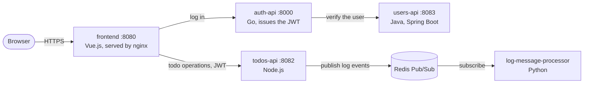
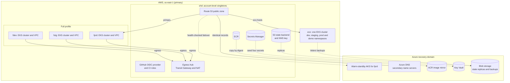
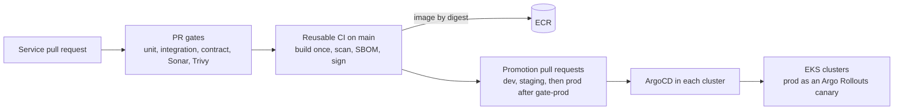

# Architecture

**Status**: current as of 2026-09-21.
**Decisions it rests on**: [constitution](../constitution.md) 4.0.0 and
[ADR-0001: Multicloud strategy](ADR-0001%20Multicloud%20strategy.md).

MicroTodoSuite is a todo application made of five services. GaCode Solutions
runs it for Lexfield Legal on AWS, with Azure as an independent recovery domain.
Terraform owns the cloud foundations, and ArgoCD owns everything that runs in a
cluster.

## Diagram index

Every diagram listed here describes the architecture as designed, not what happens
to be running on a given day; the Current state section below records that. The
draw.io files open in draw.io desktop or at app.diagrams.net.

| File | Pages | Kind | Describes |
| --- | --- | --- | --- |
| [MicroTodoSuite infrastructure.drawio](assets/MicroTodoSuite%20infrastructure.drawio) | Economical profile · Full profile | Cloud infrastructure, official AWS and Azure icons | The design as of 2026-09-21 |
| [MicroTodoSuite architecture views.drawio](assets/MicroTodoSuite%20architecture%20views.drawio) | Application · Platform overview · Namespace isolation | Architecture views | The design as of 2026-09-21 |
| [MicroTodoSuite flows.drawio](assets/MicroTodoSuite%20flows.drawio) | Delivery pipeline · Observability | Flows | The design as of 2026-09-21 |
| [MicroTodoSuite sequence diagrams.drawio](assets/MicroTodoSuite%20sequence%20diagrams.drawio) | Service CI · Promotion · Production canary · Rollback · Profile lifecycle · Secret delivery | Sequences, rendered from [Sequence diagrams](Sequence%20diagrams.md) | The implementation as of 2026-09-21 |
| [Sequence diagrams](Sequence%20diagrams.md) | Six Mermaid sequences | Sequences that render on GitHub | The implementation as of 2026-09-21 |
| The three Mermaid diagrams on this page | Application · Platform · Delivery | Summaries that render on GitHub | The design as of 2026-09-21 |
| `assets/Initial Proposal Diagram.png`, `assets/Solution Diagram.png` | — | Design history | The retired 2025 Azure Container Apps design |

## Application

The services keep no durable data. Todos live in process memory, users in a
pod-local H2 database, and Redis is neither persisted nor replicated. The
constitution requires this limit to stay disclosed until durable replication
exists, and it is the reason the platform does not route users across clouds.

## Platform

The same platform is drawn in detail, with the official AWS and Azure icons, in
[MicroTodoSuite infrastructure.drawio](assets/MicroTodoSuite%20infrastructure.drawio):
one page per profile, each drawing the architecture as designed rather than what
is running at a given moment — the Current state section below records that. Open it
with draw.io, desktop or app.diagrams.net. The Mermaid diagram above is the summary;
the draw.io file is the one to edit when the design changes.

### Environments

| Environment | Profile | Runs in | Isolation |
| --- | --- | --- | --- |
| `shd` | Shared | Account-level resources used by every environment | Single owner per resource |
| `eco` | Economical, the operational baseline | One EKS cluster | Namespaces with ResourceQuota, LimitRange, NetworkPolicy, and RBAC |
| `fdev` | Full | A dedicated EKS cluster and VPC | Cluster and VPC |
| `fstg` | Full | A dedicated EKS cluster and VPC, attached to the egress hub | Cluster and VPC |
| `fprd` | Full | A dedicated EKS cluster and VPC | Cluster and VPC |

Every AWS environment shares one account, declared once in
`microservice-app-ops/config/aws-account.env`, and `us-east-1`. Resource names
follow `lex-mts-<environment>-<type>-<key>`, where `lex` is the client code for
Lexfield Legal and `mts` the project code.
[Capacity, regions, and the account parameter](../full-platform/capacity-and-regions.md)
sets the limits that let the economical and full profiles run at the same time.

### Recovery domain

Azure exists to survive the loss of the AWS region or of the AWS account, not to
spread load. It holds a warm-standby AKS cluster for production, reconciled by
its own ArgoCD from GitHub; a mirror of every production image, copied by
digest without rebuilding; the production secrets; and off-provider copies of
Terraform state and cluster backups. Production traffic reaches Azure only
through health-checked failover. ADR-0001 records why active-active routing is
excluded, and spec 009 user story 5 schedules the Azure work last.

## Delivery

The flows behind this section — how a commit becomes a signed image, how a digest
reaches production, what the canary does when the analysis fails, how a rollback
works, how a profile goes down and comes back, and how a secret reaches a pod —
are drawn in [Sequence diagrams](Sequence%20diagrams.md).

- Each service calls the reusable workflows in `MicroTodoSuite/.github`. An image
  is built once, scanned with Trivy, described by a Syft SBOM, signed with Cosign,
  and published to ECR by digest.
- Promotion is a pull request to `microservice-app-gitops` that changes only the
  digest. Staging and production receive the identical digest in later
  promotion pull requests.
- ArgoCD reconciles every workload and platform add-on from Git. Direct
  `kubectl apply` against a managed cluster is forbidden; a rollback is a
  `git revert`.

## Cluster platform

ArgoCD owns the cluster add-ons. On the economical cluster these are External
Secrets, Kyverno, KEDA, cert-manager, and Argo Rollouts. The full profile adds
Istio and Kiali, Falco, Chaos Mesh, and OpenCost. The observability stack —
Prometheus and Alertmanager from kube-prometheus, Grafana, Loki with Alloy, and
Jaeger — is defined in `microservice-app-gitops` spec 006.

## Infrastructure as code

- `microservice-app-ops` holds the live Terraform roots and the environment
  lifecycle (`make plan-up`, `make apply-up`, `make plan-down`, `make apply-down`
  for each profile). Applies use only an approved saved plan.
- `terraform-aws-modules` and `terraform-azure-modules` hold reusable modules,
  each released independently under its own tag. The live roots consume them by
  tag.
- The rules that govern this code are in `microservice-app-ai-agents/rules/iac/`.

## Current state

On 2026-09-11 the AWS runtime was taken down for the approved rebuild under the
`lex-mts` names, recorded in `microservice-app-ops` spec 004. The economical profile
came back under those names on 2026-09-14, with all of its Applications Synced and
Healthy, and was published under `eco.microtodosuite.online` on 2026-09-15. The same
day both profiles' runtime was taken down again through the lifecycle wrapper. The
persistent resources — the state backend, KMS keys, ECR images, secrets, the public
zone, the ACM certificate, and the GitHub OIDC trust — were preserved. No
full-profile cluster exists, and the Azure recovery domain is not yet built. The
constitution's "Current state vs. plan" table tracks each capability.

## Design history: Azure Container Apps (retired)

From 2025 until 2026-08-30 the application ran on Azure Container Apps. The two
diagrams below record that design; neither describes the current platform.

### Initial proposal

### Implemented solution

The implemented design reduced the initial proposal for cost. Each service ran
as a container app pulling from Azure Container Registry, Terraform kept its
state in an Azure Storage account, Zipkin collected traces, and Prometheus with
Grafana provided metrics. The design documents of that period attributed retry
and circuit-breaker behavior to the platform; the current services do not yet
demonstrate either pattern, and the constitution tracks that gap.
