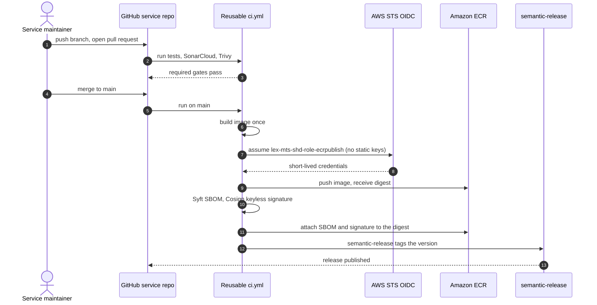
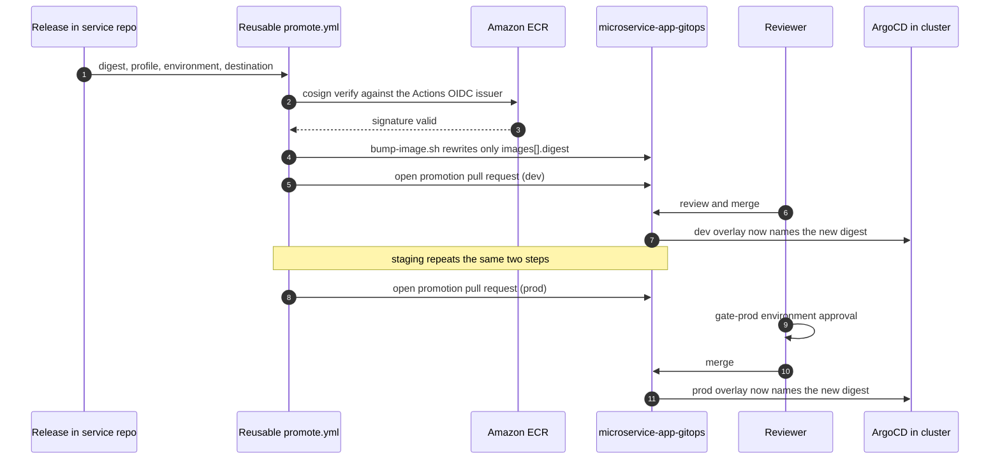
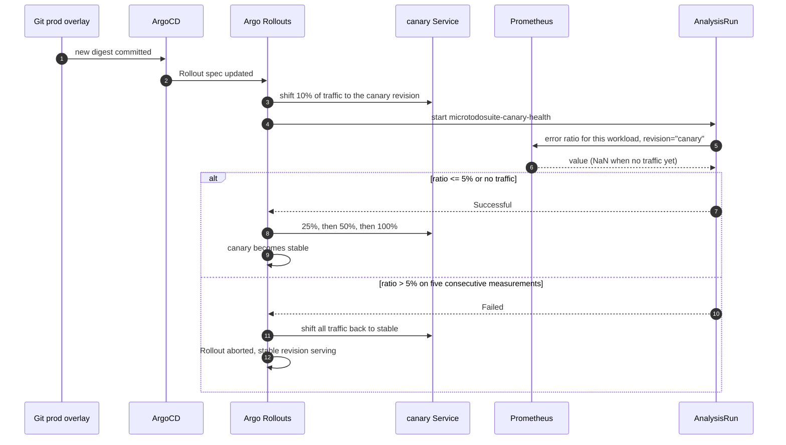
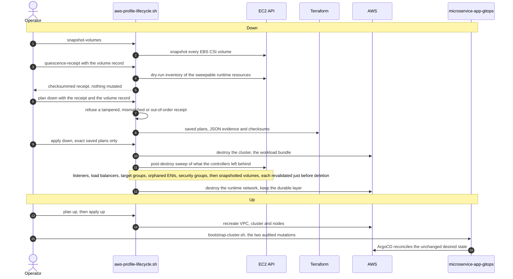
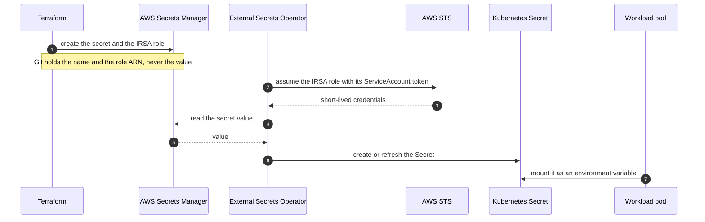

# Sequence diagrams

**Status**: current as of 2026-09-21.
**Companion to**: [Architecture diagrams](Architecture%20diagrams.md), which shows the
structure. This page shows the flows that structure carries.

Every diagram below describes what is implemented today. Where a step exists only
in the full profile, or only as a plan, it says so.

The same six diagrams are drawn in draw.io, one page each, in
[MicroTodoSuite sequence diagrams.drawio](assets/MicroTodoSuite%20sequence%20diagrams.drawio),
rendered from this page. A change to a sequence here needs the same change there.

## A commit becomes a signed image

The reusable workflow in `MicroTodoSuite/.github` builds an image once. Nothing
downstream ever rebuilds it; every later stage refers to the digest this run
produced.



## A digest reaches production

Promotion never rebuilds and never moves a tag. One pull request per environment
changes one overlay's digest, and production waits for a human.



## The production canary decides for itself

Production is an Argo Rollouts canary. The gate is real traffic measured in
Prometheus, not a synthetic probe.



## Rollback is a revert

There is no rollback button and no `kubectl` step. The cluster follows Git, so
undoing a release is undoing a commit.

```mermaid
sequenceDiagram
    autonumber
    actor Op as Operator
    participant GO as microservice-app-gitops
    participant ARGO as ArgoCD
    participant K8s as Cluster

    Op->>GO: git revert of the promotion commit
    GO->>ARGO: main now names the previous digest
    ARGO->>ARGO: detect OutOfSync
    ARGO->>K8s: apply the previous digest
    K8s-->>ARGO: Healthy on the previous revision
    Note over Op,K8s: A direct kubectl apply is forbidden; it would be reverted by the next sync
```

## A profile goes down and comes back

`scripts/aws-profile-lifecycle.sh` in `microservice-app-ops` is the only way the
runtime is created or destroyed. Applies use a saved plan and nothing else, and
the way down needs no GitOps pull request.



> Until microservice-app-ops#122 (2026-09-20) the way down needed a merged GitOps
> quiescence pull request, named by `--gitops-revision`. The receipt replaces it,
> and the sweep removes the load balancers, security groups, network interfaces
> and volumes the cluster's controllers created, which Terraform does not own.

## A secret reaches a pod without touching Git

No secret value is ever committed. The cluster reads AWS Secrets Manager with an
identity bound to the pod's ServiceAccount.


